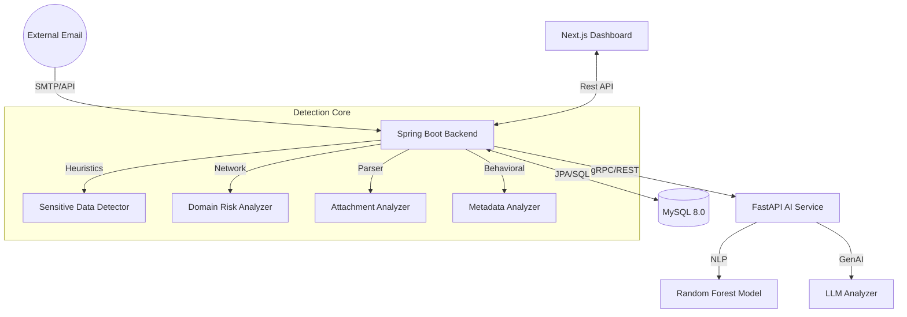

# AI Email Guardian 🛡️
## Real-Time GenAI Fraud Detection for Enterprise Email Communication

AI Email Guardian is an enterprise-grade security platform designed to protect organizations from modern email threats. Using a unique two-stage detection engine, it identifies AI-generated phishing, sensitive data leaks (SSN, Credit Cards), malicious attachments, and executive impersonation in real time.

---

## 🏛️ System Architecture

The project follows a distributed microservices architecture, optimized for scalability and modular detection:



### Technical Stack
| Layer | Technology | Role |
|-------|------------|------|
| **Frontend** | Next.js 14, TypeScript, Tailwind | Real-time threat monitoring & metrics |
| **Backend** | Spring Boot 3.2, Java 17 | Orchestration, heuristic engine, data persistence |
| **AI Service** | FastAPI, Python 3.11, Scikit-learn | Machine Learning pattern recognition & LLM reasoning |
| **Database** | MySQL 8.0 | Structured logging of emails, incidents, and trends |
| **Infrastructure**| Docker, Docker Compose | Containerized production-ready deployment |

---

## 🔍 Detection Pipeline & Decision Logic

The Guardian uses a **Two-Stage Analysis** approach to balance performance with deep security.

### Stage 1: Heuristic & Behavioral Analysis (Fast Layer)
Every email first passes through high-speed scanners (<100ms):
- **Sensitive Data Detection**: Regex & algorithmic checks for SSNs (Score: 60), Credit Cards (Score: 70), and Bank Accounts (Score: 65).
- **Domain Risk Analysis**: Detects external origins (30), typosquatting/impersonation (70), and suspicious TLDs like `.ru` or `.xyz` (50).
- **Attachment Analysis**: Scans for dangerous extensions like `.exe` (80), `.zip` (40), and MIME-type mismatches.

### Stage 2: AI Deep Analysis (Intelligence Layer)
If the heuristic score exceeds the **Risk Threshold (40)**, the AI Service is triggered:
- **ML Pattern Recognition**: A trained Random Forest model analyzes 30+ linguistic features for phishing intent.
- **Explainable AI (Optional)**: Integration with OpenAI/Ollama for semantic reasoning and detailed threat summaries.

### ⚖️ Decision Engine
Based on the final weighted score, the system takes automated actions:

| Score Range | Action | Description |
|:---:|:---:|---|
| **0 - 20** | ✅ **ALLOW** | Safe email, no threats detected. |
| **20 - 40** | ⚠️ **WARN** | Minor signals; adds a "Suspicious" banner. |
| **40 - 60** | 🚩 **HIGH RISK** | Significant threats; flags for manual security review. |
| **60+** | 🚫 **BLOCK** | Critical threat; filtered from inbox immediately. |

---

## 🚀 Quick Start

### 1. Requirements
- Docker and Docker Compose installed.

### 2. Deploy Infrastructure
```bash
cd docker
docker-compose up --build
```

### 3. Access the Platform
- **Security Dashboard**: [http://localhost:3000](http://localhost:3000)
- **Backend API Docs**: [http://localhost:8080/swagger-ui.html](http://localhost:8080/api/dashboard/stats) (or direct stats)
- **AI Health**: [http://localhost:8000/health](http://localhost:8000/health)

---

## 🛠️ Project Structure

```text
├── backend/                    # Spring Boot Detection Engine
├── ai-service/                 # Python FastAPI ML/LLM Service
├── frontend/                   # Next.js 14 Visualization Suite
├── database/                   # Schema & Initial Seed Data
└── docker/                     # Deployment Configuration
```

---

## 📊 Demo Scenarios
The system comes pre-loaded with **36+ test cases** covering:
- ✅ Legitimate corporate communications.
- 🚫 BEC (Business Email Compromise) attempts.
- 🚫 Credential harvesting on look-alike domains (micros0ft.com).
- 🚫 Data exfiltration (SSN leaks).
- 🚩 AI-generated phishing with high urgency.

---

## 🛡️ License
Distributed under the MIT License. See `LICENSE` for more information.
